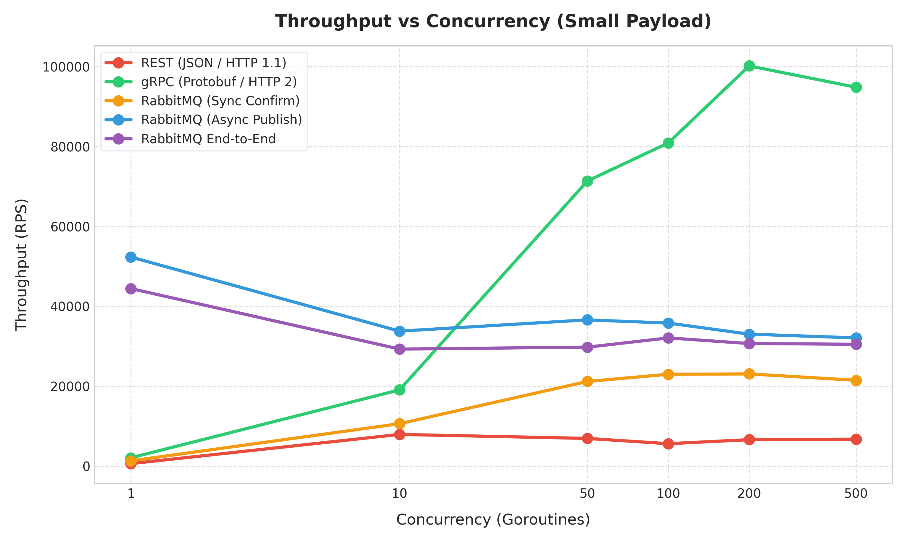
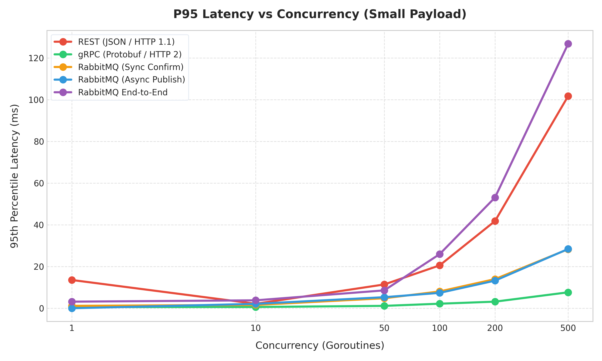
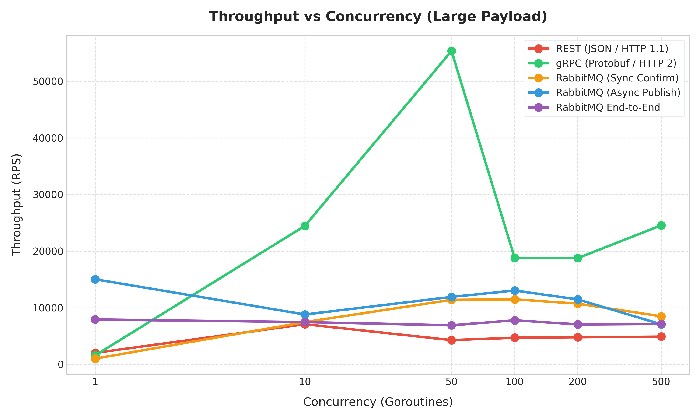
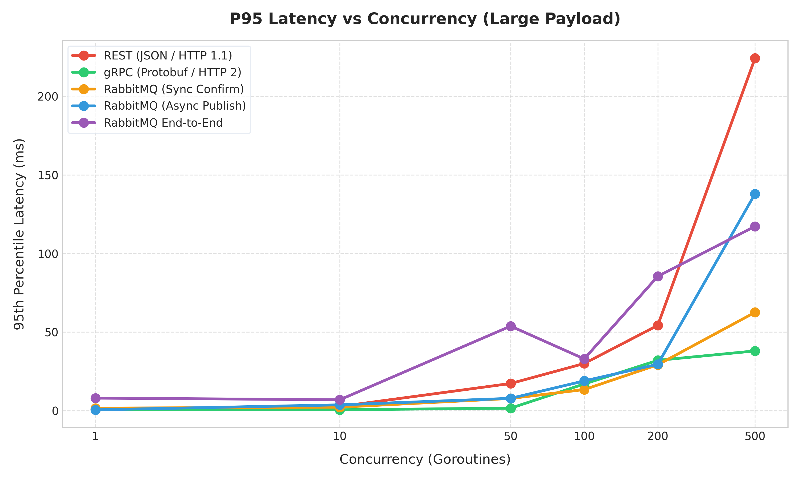

# REST vs gRPC vs RabbitMQ: Go ile Uçtan Uca Performans Karşılaştırması ve Derinlemesine Analiz

Dağıtık sistemlerin ve mikroservis mimarilerinin yaygınlaşmasıyla birlikte, servisler arası iletişim protokolü seçimi mimari başarıyı doğrudan etkileyen kritik bir karar haline gelmiştir. Geleneksel HTTP REST API'ler yerini daha yüksek performanslı alternatiflere bırakırken, hangi iletişim deseninin (Senkron İstek-Yanıt, Çoklu Bağlantı Üzerinden Akış veya Asenkron Mesaj Kuyruğu) hangi senaryoda kullanılacağı sorusu mühendisler için hala en popüler tartışma konularından biridir.

Bu makalede, modern yazılım dünyasının en popüler üç iletişim modelini (**REST**, **gRPC** ve **RabbitMQ**) gerçek zamanlı benchmark testlerine tabi tutarak; **throughput (RPS)**, **gecikme (latency percentiles)** ve **veri boyutu (payload size)** metrikleri üzerinden kıyaslayacağız. Testlerin tamamı yüksek performanslı Go programlama diliyle geliştirilen istemci ve sunucularla, kontrollü bir yerel ortamda gerçekleştirilmiştir.

---

## 1. Teknolojilerin Teknik Anatomisi

Performans sonuçlarına geçmeden önce karşılaştırdığımız protokollerin mimari temellerine göz atalım:

| Özellik | REST (HTTP/1.1) | gRPC (HTTP/2) | RabbitMQ (AMQP 0-9-1) |
| :--- | :--- | :--- | :--- |
| **Protokol** | HTTP/1.1 (Metin tabanlı) | HTTP/2 (Binary tabanlı) | AMQP 0-9-1 (Binary tabanlı) |
| **Serileştirme** | JSON (Text / UTF-8) | Protocol Buffers (Binary) | JSON veya Ham Binary (Biz JSON kullandık) |
| **İletişim Deseni** | Senkron İstek-Yanıt | Senkron İstek-Yanıt / Çift Yönlü Streaming | Asenkron / Producer-Consumer |
| **Bağlantı Yapısı** | Bağlantı Havuzu (Keep-Alive) | Tek TCP Bağlantısında Çoklama (Multiplexing) | Tek TCP Bağlantısında Kanal Çoklama (Multiplexing) |
| **Güvenilirlik Seviyesi**| HTTP Status Kodları | gRPC Status Kodları | Publisher Confirms (ACK / NACK mekanizması) |

### REST (JSON over HTTP/1.1)
REST, evrensel uyumluluğu ve geliştirici dostu yapısı nedeniyle standart tercihtir. Ancak HTTP/1.1 yapısı gereği **Head-of-Line (HOL) Blocking** problemine tabidir; yani bir TCP bağlantısı üzerinden aynı anda sadece tek bir istek-yanıt işlenebilir. Bağlantı havuzları kullanılsa da yüksek eşzamanlılıkta TCP bağlantı kurma/yönetme maliyeti ve JSON serileştirme/deserileştirme işleminin CPU üzerindeki yükü REST'i performans açısından sınırlar.

### gRPC (Protobuf over HTTP/2)
Google tarafından geliştirilen gRPC, HTTP/2 protokolünün sağladığı tüm avantajları kullanır. HTTP/2, tek bir TCP bağlantısı üzerinden binlerce isteğin aynı anda eşzamanlı (multiplexed) gönderilmesine olanak tanır. Veriler metin yerine **Protocol Buffers** adı verilen, şemaya dayalı oldukça sıkıştırılmış binary bir formatta serileştirilir. Bu sayede hem ağda taşınan paket küçülür hem de CPU tarafındaki serileştirme/deserileştirme maliyeti neredeyse sıfıra iner.

### RabbitMQ (AMQP 0-9-1)
RabbitMQ, servisleri gevşek bağlı (loosely-coupled) hale getiren asenkron bir mesaj aracısıdır (Message Broker). Bu karşılaştırmada RabbitMQ'yu üç farklı modda test ettik:
1. **Sync Confirm:** Her mesaj gönderildiğinde RabbitMQ broker'ından onay (ACK) gelmesini bekler. Bu mod, REST/gRPC'ye benzer şekilde "verinin ulaştığından emin olma" güvencesi sağlar.
2. **Async (Fire-and-Forget):** İstemci mesajları arkasına bakmadan gönderir. Maksimum ağ yazma hızını ölçer.
3. **End-to-End (E2E) Latency:** Mesajın üreticiden (Publisher) çıkıp, RabbitMQ kuyruğundan geçerek tüketiciye (Consumer) ulaştığı ve işlendiği toplam süreyi ölçer.

---

## 2. Test Metodolojisi ve Ortam

Adil bir karşılaştırma yapabilmek için her üç iletişim yöntemine de birebir aynı veri yapılarını taşıttık.

### Test Donanımı ve Altyapı
- **İşletim Sistemi:** Windows (WSL2 / Docker Desktop ortamında RabbitMQ)
- **Çalışma Zamanı (Runtime):** Go v1.26.4 (Performans kaybını önlemek için kodlar önceden binary olarak derlenmiştir)
- **Mesaj Kuyruğu:** RabbitMQ 3-Management (Docker container)

### Veri Setleri (Payloads)
1. **Küçük Payload (~250 byte):** Tipik bir işlem/log olayı.
2. **Büyük Payload (~10 KB):** Geniş sepet verisi veya detaylı JSON/Protobuf şeması (içerisinde 10KB rastgele karakter dizisi barındırır).

### Test Matrisi
- **Eşzamanlılık Seviyeleri (Goroutine Sayısı):** 1, 10, 50, 100, 200, 500
- **Toplam İstek Sayısı:** İstek sayıları, düşük eşzamanlılıklarda kararlı sonuçlar alacak kadar yüksek, yüksek eşzamanlılıklarda ise donanım kaynaklarını kilitlemeyecek düzeyde dinamik olarak belirlenmiştir (İstek sayısı 1000 ile 20000 arasında ölçeklenmiştir).

---

## 3. Benchmark Sonuçları

Aşağıdaki tablolar, gerçekleştirdiğimiz testler sonucunda elde ettiğimiz ham verileri göstermektedir.

### 3.1. Küçük Payload (~250 byte) Performans Tablosu

| Protokol / Mod | Eşzamanlılık (Goroutine) | Toplam İstek | Throughput (RPS) | P50 Gecikme (ms) | P95 Gecikme (ms) | P99 Gecikme (ms) |
| :--- | :---: | :---: | :---: | :---: | :---: | :---: |
| **REST** | 1 | 5.000 | 630.9 | 0.52 | 13.54 | 16.59 |
| | 10 | 10.000 | 7.938.7 | 1.05 | 2.13 | 2.60 |
| | 50 | 20.000 | 6.935.1 | 6.89 | 11.40 | 14.13 |
| | 100 | 20.000 | 5.615.0 | 13.34 | 20.55 | 23.87 |
| | 200 | 20.000 | 6.622.8 | 28.68 | 41.78 | 46.04 |
| | 500 | 20.000 | **6.752.3** | 67.02 | 101.77 | 235.91 |
| **gRPC** | 1 | 5.000 | 2.088.4 | 0.00 | 0.58 | 13.43 |
| | 10 | 10.000 | 19.089.9 | 0.00 | 0.60 | 13.13 |
| | 50 | 20.000 | 71.375.2 | 0.53 | 1.13 | 1.67 |
| | 100 | 20.000 | 80.899.9 | 1.07 | 2.16 | 2.91 |
| | 200 | 20.000 | **100.181.8** | 2.07 | 3.15 | 7.42 |
| | 500 | 20.000 | 94.834.4 | 4.93 | 7.63 | 9.61 |
| **MQ (Confirm)** | 1 | 5.000 | 1.319.1 | 0.55 | 1.14 | 1.58 |
| | 10 | 10.000 | 10.623.7 | 1.03 | 1.59 | 2.64 |
| | 50 | 20.000 | 21.194.5 | 1.64 | 4.78 | 7.72 |
| | 100 | 20.000 | 22.990.6 | 3.62 | 8.05 | 12.54 |
| | 200 | 20.000 | **23.082.2** | 7.28 | 13.96 | 53.67 |
| | 500 | 20.000 | 21.488.6 | 18.17 | 28.31 | 78.44 |
| **MQ (Async)** | 1 | 5.000 | **52.340.0** | 0.00 | 0.00 | 0.53 |
| | 10 | 10.000 | 33.789.8 | 0.00 | 2.09 | 4.26 |
| | 50 | 20.000 | 36.606.6 | 0.00 | 5.29 | 6.84 |
| | 100 | 20.000 | 35.808.3 | 0.00 | 7.36 | 8.95 |
| | 200 | 20.000 | 33.037.0 | 4.66 | 13.23 | 15.90 |
| | 500 | 20.000 | 32.104.4 | 8.91 | 28.42 | 51.80 |

### 3.2. Büyük Payload (~10 KB) Performans Tablosu

| Protokol / Mod | Eşzamanlılık (Goroutine) | Toplam İstek | Throughput (RPS) | P50 Gecikme (ms) | P95 Gecikme (ms) | P99 Gecikme (ms) |
| :--- | :---: | :---: | :---: | :---: | :---: | :---: |
| **REST** | 1 | 1.000 | 2.024.3 | 0.52 | 0.64 | 1.07 |
| | 10 | 2.000 | **7.085.1** | 1.05 | 2.65 | 9.46 |
| | 50 | 5.000 | 4.276.9 | 11.09 | 17.27 | 19.18 |
| | 100 | 5.000 | 4.703.8 | 20.32 | 29.99 | 40.86 |
| | 200 | 5.000 | 4.781.7 | 38.66 | 54.27 | 85.08 |
| | 500 | 5.000 | 4.899.2 | 81.96 | 224.24 | 268.12 |
| **gRPC** | 1 | 1.000 | 1.586.9 | 0.00 | 0.64 | 14.29 |
| | 10 | 2.000 | 24.448.0 | 0.52 | 0.55 | 1.08 |
| | 50 | 5.000 | **55.334.9** | 1.04 | 1.58 | 3.28 |
| | 100 | 5.000 | 18.803.9 | 1.64 | 16.97 | 22.58 |
| | 200 | 5.000 | 18.747.9 | 3.68 | 32.01 | 39.67 |
| | 500 | 5.000 | 24.536.7 | 19.66 | 38.00 | 43.37 |
| **MQ (Confirm)** | 1 | 1.000 | 1.011.7 | 1.05 | 1.59 | 2.17 |
| | 10 | 2.000 | 7.456.7 | 1.06 | 2.20 | 3.68 |
| | 50 | 5.000 | 11.387.2 | 4.20 | 7.77 | 10.95 |
| | 100 | 5.000 | **11.476.5** | 7.35 | 13.41 | 31.25 |
| | 200 | 5.000 | 10.714.1 | 14.98 | 29.19 | 44.67 |
| | 500 | 5.000 | 8.478.3 | 45.71 | 62.55 | 69.89 |
| **MQ (Async)** | 1 | 1.000 | **15.016.3** | 0.00 | 0.52 | 0.57 |
| | 10 | 2.000 | 8.797.6 | 0.00 | 3.70 | 15.22 |
| | 50 | 5.000 | 11.898.9 | 3.71 | 7.83 | 25.87 |
| | 100 | 5.000 | 13.032.8 | 6.33 | 18.91 | 39.32 |
| | 200 | 5.000 | 11.460.8 | 14.97 | 29.49 | 46.97 |
| | 500 | 5.000 | 7.069.3 | 53.44 | 137.97 | 166.96 |

---

## 4. Grafiklerle Görsel Analiz

Toplanan benchmark sonuçları doğrultusunda çizdirilen performans grafikleri aşağıdadır:

### 4.1. Küçük Payload (~250 byte) Karşılaştırması

#### Eşzamanlılığa Göre Throughput (RPS) Grafik Analizi
Aşağıdaki grafikte göreceğiniz üzere, gRPC küçük paketlerde eşzamanlılık arttıkça muazzam bir şekilde ölçeklenmekte ve 200 eşzamanlılıkta saniyede **100.000 isteğin üzerine** çıkmaktadır. REST ise 8.000 RPS civarında bir doygunluğa (saturation) ulaşmaktadır.

#### Eşzamanlılığa Göre P95 Gecikme (Latency) Grafik Analizi
REST'in gecikme eğrisi eşzamanlılık arttıkça dik bir şekilde yükselirken, gRPC ve RabbitMQ yüksek eşzamanlılıkta dahi 10 ms barajının altında kalarak kararlı bir yanıt süresi sunmaktadır.

---

### 4.2. Büyük Payload (~10 KB) Karşılaştırması

#### Eşzamanlılığa Göre Throughput (RPS) Grafik Analizi
Veri paketi 10 KB seviyesine çıktığında, gRPC yine ezici üstünlüğünü koruyarak saniyede **55.000 isteğin** üzerine çıkabilmektedir. Büyük paketlerde JSON parse yükü arttığı için REST ancak 7.000 RPS limitine ulaşabilmiştir.

#### Eşzamanlılığa Göre P95 Gecikme (Latency) Grafik Analizi
Büyük payload durumunda REST sunucusunun P95 gecikmesi 500 eşzamanlılıkta **224 ms** seviyelerine fırlarken, gRPC en yüksek yük altında bile **38 ms** gecikme ile kararlılığını korumaktadır.

---

## 5. Mühendislik Değerlendirmesi ve Altın Kurallar (Deep Dive)

Elde ettiğimiz bu çarpıcı sonuçların ardındaki mühendislik nedenlerini analiz edelim:

### 1. gRPC'nin Ezici Üstünlüğü: Neden 12 Kat Daha Hızlı?
gRPC'nin REST'i saniyede 100.000 istek seviyesinde (küçük payload) geride bırakmasının iki temel sebebi vardır:
- **HTTP/2 Eşzamanlılığı (Multiplexing):** REST, her paralel istek için yeni bir TCP bağlantısı kurmak veya bağlantı havuzundaki müsait bir bağlantıyı beklemek zorundadır. gRPC ise **tek bir TCP bağlantısı** üzerinden HTTP/2 stream'leri sayesinde binlerce isteği aynı anda gönderir. Bu durum, ağdaki el sıkışmalarını ve soket yönetim maliyetini ortadan kaldırır.
- **Protocol Buffers Verimliliği:** JSON verileri "string" tabanlıdır. Her REST isteğinde sunucu, string karakterleri tek tek okuyup CPU üzerinde JSON parse işlemi yapar. Protobuf ise veriyi binary formatta paketler. Değerlerin byte dizilimindeki yerleri sabittir, bu sayede deserileştirme işlemi doğrudan bellek okuması kadar hızlıdır ve neredeyse hiç CPU harcamaz.

### 2. RabbitMQ'nun Asenkron Gücü ve Doğru Kullanımı
Test sonuçlarında **RabbitMQ Async (Fire-and-Forget)** modunun, tek iş parçacığında bile saniyede **52.000** mesaja kadar çıkabildiğini gördük. Bunun nedeni istemcinin broker'dan herhangi bir ağ yanıtı beklememesidir. 
Ancak verinin kaybolmamasının kritik olduğu (örneğin finansal işlemler) senaryolarda **Confirm Mode** devreye alınmalıdır. Confirm modunda throughput oranının 23k (küçük) ve 11k (büyük) seviyelerine düştüğünü görüyoruz. Bu düşüşe rağmen, RabbitMQ'nun kanalları çoklaması sayesinde REST API'den hala daha yüksek throughput ve daha düşük gecikmeler elde edilmektedir.

### 3. RabbitMQ End-to-End (Uçtan Uca) Gecikme Sürprizi
`rabbitmq_e2e` testlerinde, bir mesajın üretilip kuyruktan geçerek tüketiciye ulaştığı uçtan uca gecikmenin, düşük yük altında **2.8 ms**, yoğun yük altında (500 concurrency) ise en fazla **82 ms** olduğunu ölçtük. Bu, RabbitMQ gibi bir message broker'ın araya girmesinin, sistemlerinize korkulanın aksine göz ardı edilebilir düzeyde küçük bir gecikme eklediğini kanıtlamaktadır.

---

## 6. Özet & Karar Matrisi: Hangisini Seçmeli?

Benchmark sonuçlarımız ışığında, projelerinizde doğru mimari kararı vermeniz için pratik bir rehber hazırladık:

### 🔴 REST API (JSON / HTTP 1.1) Tercih Edin:
- API'leriniz dış dünyaya (üçüncü parti geliştiricilere, mobil uygulamalara, web tarayıcılarına) açılacaksa (JSON küresel bir standarttır).
- Basitlik, hızlı entegrasyon ve evrensel kütüphane desteği en önemli önceliğinizse.
- Saniyedeki istek oranınız < 5.000 RPS seviyesindeyse (REST bu yükleri Go ile sıfır gecikmeyle taşır).

### 🟢 gRPC (Protobuf / HTTP 2) Tercih Edin:
- **Mikroservisler arası iç iletişimde (Internal Service-to-Service):** Kesinlikle varsayılan tercihiniz olmalıdır. Ağ bant genişliğini ve CPU tüketimini dramatik ölçüde düşürür.
- Yüksek throughput (saniyede 10.000+ istek) ve ultra düşük gecikme gerektiren finans, oyun veya veri işleme hatlarında.
- Mobil istemciler ile backend servisleri arasında yüksek hızlı veri akışı gerektiğinde.

### 🔵 RabbitMQ (AMQP) Tercih Edin:
- **Gevşek Bağlılık (Decoupling):** Servislerin anlık olarak birbirinin ayakta olmasına bağımlı olmasını istemediğinizde (Sipariş kuyruğu, e-posta gönderimi vb.).
- **Arka Plan İşleri (Background Jobs / Heavy Processing):** Kullanıcıyı bekletmeden arka planda asenkron olarak işlenmesi gereken yoğun hesaplamalar olduğunda.
- **Yük Dengeleme (Throttling / Load Leveling):** Sisteminize anlık gelen yüksek trafik dalgalanmalarını kuyrukta biriktirip, alt servisleri ezmeden sabit bir hızla eritmek istediğinizde.
- **Event-Driven Mimari:** Bir işlem tamamlandığında birden fazla servisin (Örn: bildirim servisi, fatura servisi, kargo servisi) asenkron olarak haberdar olması gerektiğinde (Publish-Subscribe deseni).
